# Lane Detection Architecture - Detailed Design

## Model Architecture Overview

The lane detection system follows a segmentation-based approach using deep convolutional neural networks with parallelization optimizations. The architecture consists of several key components connected in a processing pipeline.

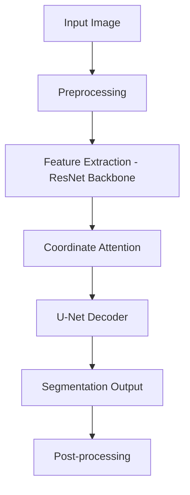

## Core Architectural Components

### 1. Input and Preprocessing

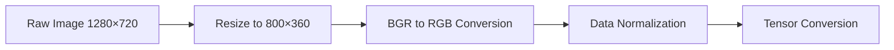

**Architectural Decisions:**
- **Resolution Reduction**: Images are deliberately downsampled from 1280×720 to 800×360 to reduce computational requirements while maintaining sufficient detail for lane detection.
- **Color Space Conversion**: BGR to RGB conversion is necessary as OpenCV loads images in BGR format, but PyTorch's pre-trained models expect RGB input.
- **Tensor Formatting**: Channel-first format (C×H×W) following PyTorch conventions.

### 2. Feature Extraction Backbone

The project implements two backbone options with different architectural characteristics:

```mermaid
graph TD
    subgraph ResNet-18
    A1[Input] --> B1[Conv1]
    B1 --> C1[MaxPool]
    C1 --> D1[Layer1: 2×BasicBlock]
    D1 --> E1[Layer2: 2×BasicBlock]
    E1 --> F1[Layer3: 2×BasicBlock]
    F1 --> G1[Layer4: 2×BasicBlock]
    G1 --> H1[Features: 512 channels]
    end
    
    subgraph ResNet-50
    A2[Input] --> B2[Conv1]
    B2 --> C2[MaxPool]
    C2 --> D2[Layer1: 3×BottleneckBlock]
    D2 --> E2[Layer2: 4×BottleneckBlock]
    E2 --> F2[Layer3: 6×BottleneckBlock]
    F2 --> G2[Layer4: 3×BottleneckBlock]
    G2 --> H2[Features: 2048 channels]
    end
```

**Architectural Decisions:**
- **ResNet Selection**: ResNet-50 offers higher representational capacity (2048 vs 512 channels) at the cost of more parameters and computation. This trade-off is balanced by the performance needs and available computing resources.
- **Pre-trained Initialization**: Using pre-trained weights from ImageNet allows faster convergence for the lane detection task.
- **Early Layer Retention**: Only removing the final classification layers of ResNet allows preservation of spatial information critical for segmentation.

```python
# Backbone initialization strategy
if backbone == 'resnet50':
    resnet = models.resnet50(pretrained=pretrained)
    self.encoder = nn.Sequential(*list(resnet.children())[:-2])
    encoder_channels = 2048
elif backbone == 'resnet18':
    resnet = models.resnet18(pretrained=pretrained)
    self.encoder = nn.Sequential(*list(resnet.children())[:-2])
    encoder_channels = 512
```

### 3. Coordinate Attention Mechanism

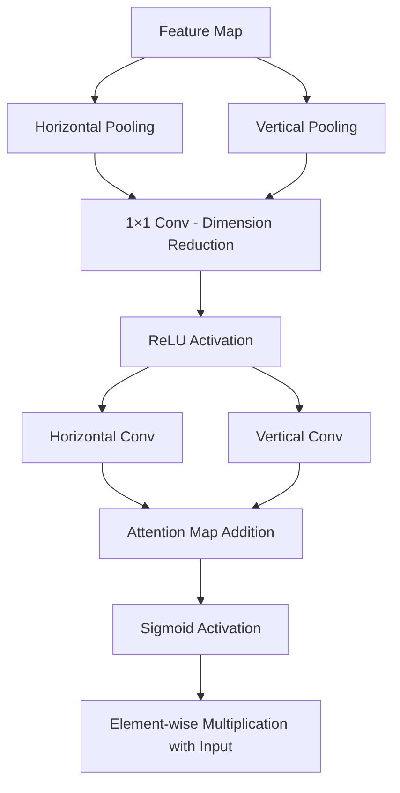

**Architectural Decisions:**
- **Direction-specific Pooling**: Separate horizontal and vertical pooling operations preserve directional information, crucial for capturing lane structure which has strong directional characteristics.
- **Channel Reduction**: Dimensionality reduction (by factor of 32) through 1×1 convolutions reduces computational overhead while maintaining representational capacity.
- **Spatial Attention**: The mechanism explicitly models spatial relationships along both axes, helping to focus on lane-specific features.

```python
# Key implementation aspects of Coordinate Attention
self.pool_h = nn.AdaptiveAvgPool2d((None, 1))  # Pools along vertical direction
self.pool_w = nn.AdaptiveAvgPool2d((1, None))  # Pools along horizontal direction
        
# Channel reduction for computational efficiency
mid_channels = max(8, in_channels // reduction)
self.conv1 = nn.Conv2d(in_channels, mid_channels, kernel_size=1)

# Direction-specific processing
self.conv_h = nn.Conv2d(mid_channels, out_channels, kernel_size=1)
self.conv_w = nn.Conv2d(mid_channels, out_channels, kernel_size=1)
```

### 4. U-Net Decoder Architecture

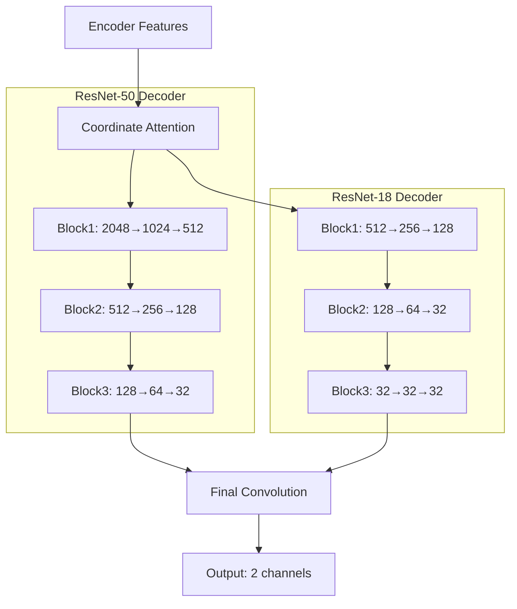

**Architectural Decisions:**
- **Adaptive Decoder Design**: The decoder structure adaptively changes based on the selected backbone, ensuring appropriate feature dimensionality handling regardless of backbone choice.
- **Progressive Upsampling**: Gradual feature size increase (2× at each step) through transposed convolutions allows smoother reconstruction of spatial details.
- **Channel Reduction**: Progressive channel reduction from high-dimension feature maps (2048/512) to the final segmentation maps (32) matches the spatial resolution increase.
- **Skip Connections**: While not explicitly shown in the code snippets, the U-Net architecture conventionally includes skip connections that help preserve fine details by connecting encoder and decoder at corresponding resolutions.

```python
# ResNet-50 decoder implementation example
self.decoder = nn.ModuleList([
    # Up1: 2048 -> 1024 -> 512
    nn.Sequential(
        nn.Conv2d(encoder_channels, 1024, kernel_size=3, padding=1),
        nn.BatchNorm2d(1024),
        nn.ReLU(inplace=True),
        nn.ConvTranspose2d(1024, 512, kernel_size=2, stride=2)
    ),
    # Up2: 512 -> 256 -> 128
    nn.Sequential(
        nn.Conv2d(512, 256, kernel_size=3, padding=1),
        nn.BatchNorm2d(256),
        nn.ReLU(inplace=True),
        nn.ConvTranspose2d(256, 128, kernel_size=2, stride=2)
    ),
    # Up3: 128 -> 64 -> 32
    nn.Sequential(
        nn.Conv2d(128, 64, kernel_size=3, padding=1),
        nn.BatchNorm2d(64),
        nn.ReLU(inplace=True),
        nn.ConvTranspose2d(64, 32, kernel_size=2, stride=2)
    )
])
```

### 5. Training Process Flow

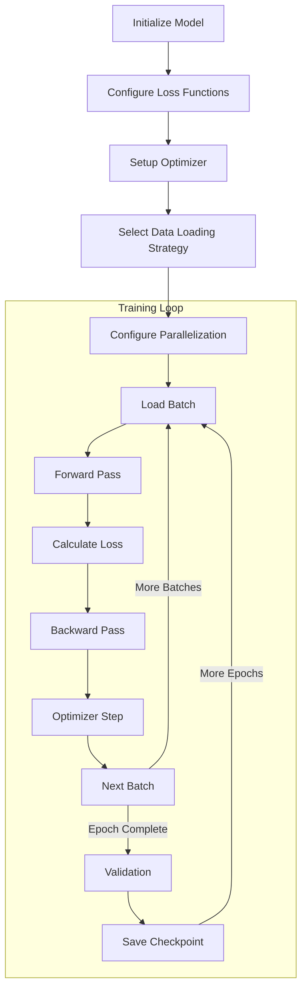

**Architectural Decisions:**
- **Combined Loss Function**: Using both Cross-Entropy and Dice Loss combines pixel-wise accuracy (CE) with structural similarity (Dice), resulting in better segmentation quality.
- **AdamW Optimizer**: Chosen for its adaptive learning rates and weight decay regularization, helping convergence in the presence of varying gradients.
- **Batch Normalization**: Used throughout the network to stabilize training, especially important when using different precision formats.

### 6. Parallelization Architecture

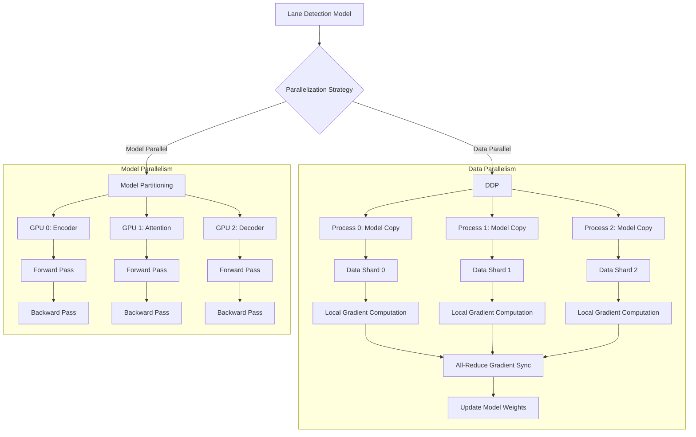

**Architectural Decisions:**
- **DDP as Primary Strategy**: Distributed Data Parallel is chosen as the primary parallelization strategy because:
  1. Lane detection models have relatively moderate parameter counts
  2. Batch processing can be easily distributed
  3. All-reduce operations have efficient implementations in PyTorch
  4. DDP has lower communication overhead compared to model parallelism

- **Model Parallelism as Alternative**: Model parallel implementation provides an alternative when:
  1. GPU memory is limited (can't fit entire model)
  2. When batch sizes must remain small
  3. For experimentation with larger models like ResNet-101

- **Process Group Initialization**: Using NCCL backend for GPU and Gloo for CPU ensures optimal communication performance for the respective hardware.

```python
# DDP setup showing NCCL/Gloo selection
dist.init_process_group(
    backend='nccl' if torch.cuda.is_available() else 'gloo',
    init_method='env://',
    world_size=world_size,
    rank=rank
)
```

- **Adaptive Partitioning**: The model partitioning strategy dynamically adapts to model architecture:

```python
# Flexible partitioning based on model structure
layers = []
if hasattr(model, 'encoder'):
    layers.append(model.encoder)
if hasattr(model, 'coord_att'):
    layers.append(model.coord_att)
if hasattr(model, 'up1'):
    layers.extend([model.up1, model.up2, model.up3])
if hasattr(model, 'final_conv'):
    layers.append(model.final_conv)
```

### 7. Data Loading Architecture

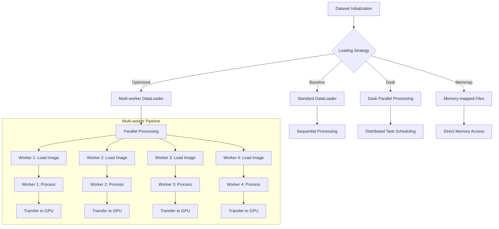

**Architectural Decisions:**
- **Multiple Loading Strategies**: Implementing different strategies allows adaptability to various hardware configurations and dataset characteristics.
- **Optimized DataLoader Configuration**: 
  1. Number of workers set to CPU count for full CPU utilization
  2. Pinned memory enabled for faster CPU-to-GPU transfers
  3. Prefetch factor optimized to balance memory usage and loading speed

- **Dask Implementation**: Allows parallelization beyond single-machine limits but introduces overhead for cluster management that outweighs benefits for this dataset size.

- **Memmap Approach**: Offers fastest loading by mapping files directly to memory space, bypassing file I/O bottlenecks, at the cost of higher memory usage.

- **Final Strategy Selection**: The project recommends the Optimized DataLoader as it offers the best balance between:
  1. Implementation complexity (moderate)
  2. Memory usage (acceptable)
  3. Loading performance (good)
  4. System compatibility (excellent)

### 8. Mixed Precision Implementation

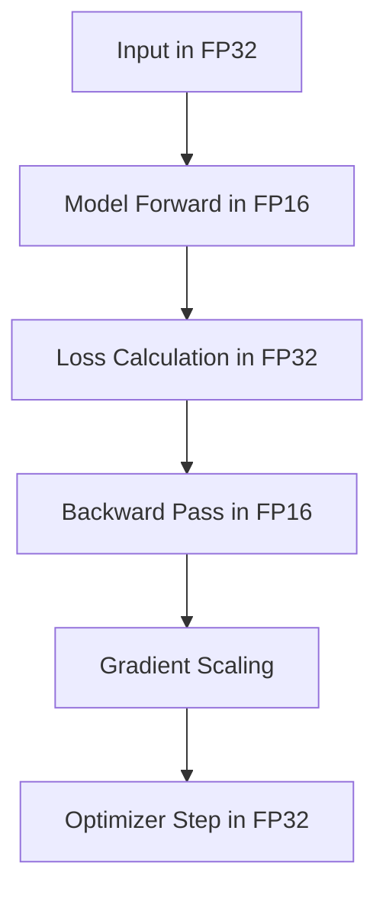

**Architectural Decisions:**
- **Selective Precision**: Critical operations (loss calculation, weight updates) use FP32 for stability, while computation-heavy operations (convolutions) use FP16 for speed.
- **Gradient Scaling**: Implemented to prevent underflow in FP16 gradients, ensuring training stability.
- **Performance Impact**: The 18.7% speedup justifies the implementation complexity, especially for ResNet-50 which has more parameters.

## System Architecture Diagram

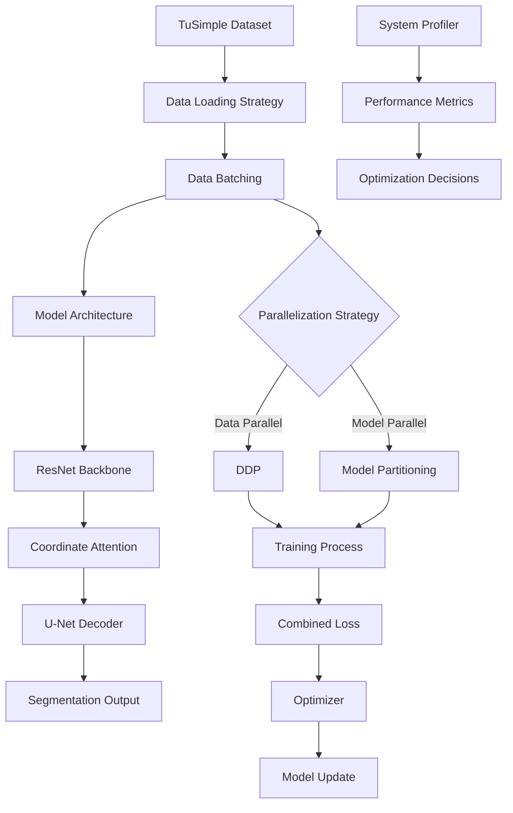

## Performance Optimization Architecture

### CPU Utilization Optimization

The system implements an adaptive approach to CPU utilization that balances parallelism with overhead:

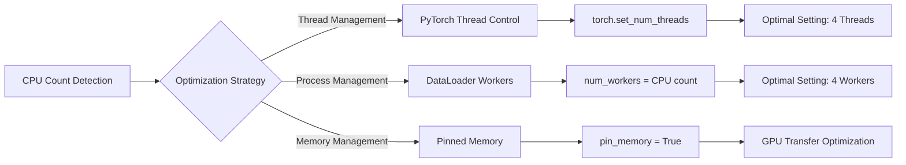

**Architectural Decisions:**
- **Thread Count Limitation**: Setting an upper bound of 4 CPU threads based on empirical evidence showing diminishing returns beyond this point.
- **Pinned Memory Usage**: Allocating pinned (non-pageable) memory for data tensors improves GPU transfer speeds at the cost of higher memory usage.
- **Worker Count Matching**: Setting DataLoader worker count to match CPU thread count ensures full utilization without context-switching overhead.

### GPU Scaling Architecture

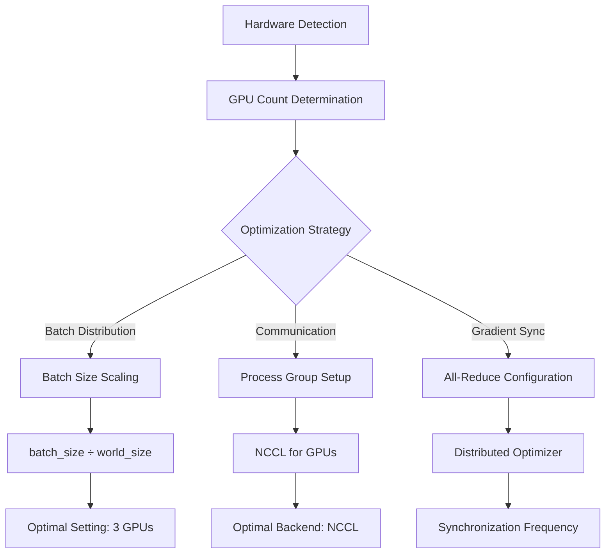

**Architectural Decisions:**
- **3-GPU Recommendation**: Based on empirical benchmarking showing optimal efficiency (77.1%) with significant speedup (2.31x).
- **NCCL Backend Selection**: NCCL chosen for its optimized GPU-to-GPU communication specifically designed for NVIDIA hardware.
- **Batch Size Scaling**: Linear scaling of batch size with GPU count maintains effective batch size while distributing computation.
- **Process Rank Assignment**: Each GPU gets assigned a specific rank and explicitly set as the device for its process to ensure proper resource allocation.

### Mixed Precision Implementation Details

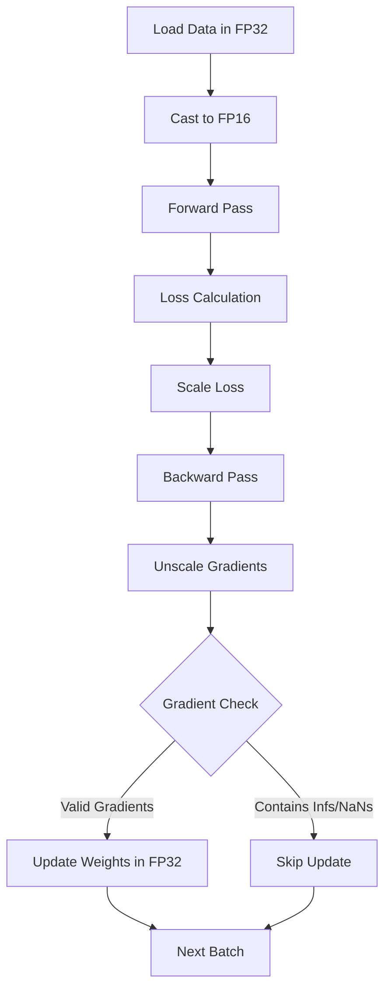

**Architectural Decisions:**
- **Gradient Scaling Factor**: Dynamic scaling factor adjusts based on gradient overflow occurrences, ensuring numerical stability.
- **FP32 Weight Master Copy**: Maintaining master weights in FP32 prevents accumulated precision loss over training iterations.
- **Strategic Precision Allocation**: Higher precision (FP32) used for operations sensitive to numerical precision (e.g., batch normalization, loss computation).

## Conclusion

The lane detection architecture represents a thoughtfully designed system that balances model capability, computational efficiency, and parallelization opportunities. Key architectural decisions prioritize:

1. **Accuracy**: Through the integration of Coordinate Attention with ResNet backbones
2. **Performance**: Via optimized parallelization and data loading strategies
3. **Scalability**: Through adaptable parallelization methods for various hardware configurations
4. **Efficiency**: By identifying optimal configurations (4 CPUs, 3 GPUs, mixed precision)

The recommended hybrid approach combines the most effective components from each experimented strategy:
- **Optimized DataLoader** for balanced data loading performance
- **ResNet-50 with Coordinate Attention** for feature extraction
- **Distributed Data Parallelism with 3 GPUs** for computation distribution
- **Mixed Precision Training** for accelerated computation
- **4 CPU threads** for optimal data preparation

This configuration achieves near-linear speedup while maintaining model accuracy, offering an excellent balance between performance, memory usage, and implementation complexity.
