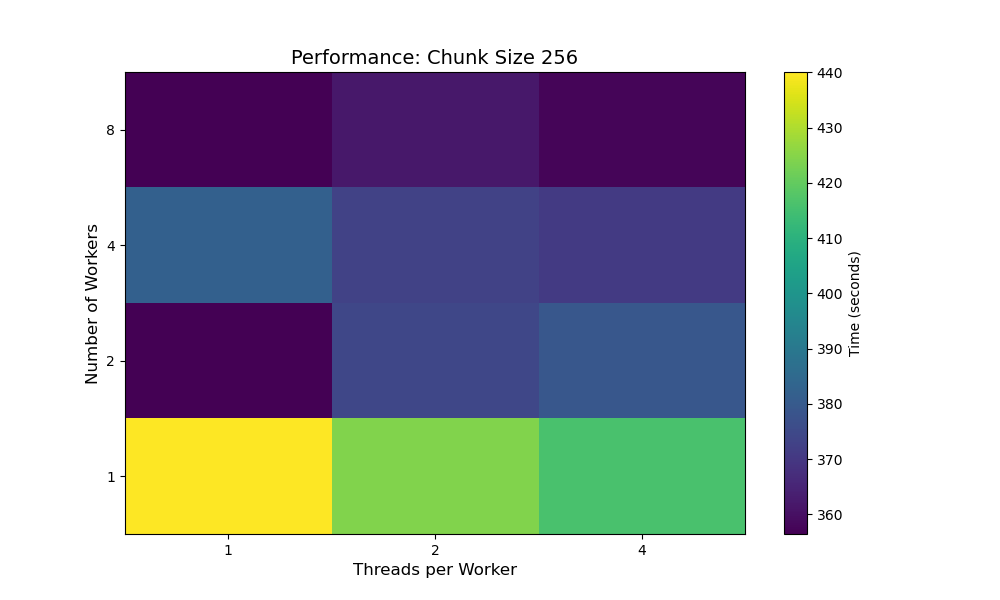
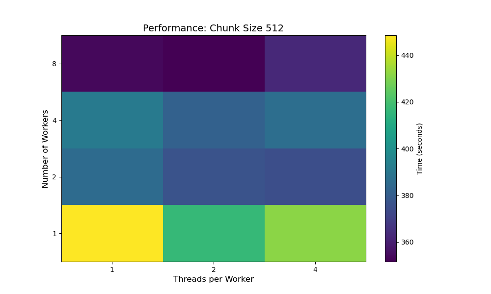
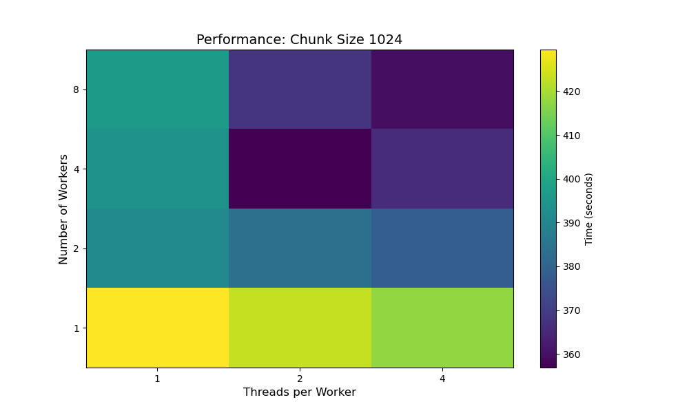
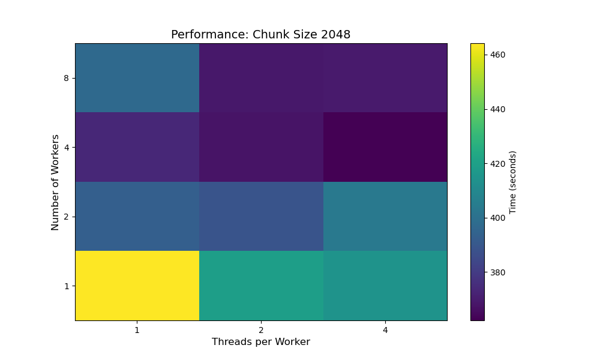

# Dask Configuration Analysis for TUSimple Dataset

This document presents a comprehensive analysis of various Dask configurations for processing the TUSimple lane detection dataset. It explores how different combinations of workers, threads per worker, and chunk sizes impact data processing performance.

## Overview

Dask is a flexible parallel computing library for Python that allows for efficient data processing across multiple cores or machines. This analysis examines how different Dask configuration parameters affect the processing of image data for lane detection.

## Test Configuration

The analysis was conducted with the following parameters:

- **Worker Counts**: 1, 2, 4, and 8 workers
- **Threads per Worker**: 1, 2, and 4 threads
- **Chunk Sizes**: 256, 512, 1024, and 2048
- **Memory Allocation**: 16GB per worker
- **Dataset**: TUSimple lane detection dataset (image size: 800×360 pixels)

## Dask Implementation

The implementation uses a custom `LaneDatasetWithDask` class that:

1. Loads images and segmentation maps from the TUSimple dataset
2. Uses Dask's `delayed` and `compute` functions for parallel preprocessing
3. Converts processed data to PyTorch tensors for model training

```python
# Key preprocessing functions
def preprocess_image(self, img_path):
    """Delayed preprocessing for image files."""
    return delayed(self._load_and_resize_image)(img_path)

def preprocess_segmentation(self, seg_path):
    """Delayed preprocessing for segmentation files."""
    return delayed(self._load_and_process_segmentation)(seg_path)
```

## Performance Results

### Overall Performance by Chunk Size

The analysis produced heatmaps showing the processing time for each combination of workers and threads per worker, at different chunk sizes:


*Figure 1: Performance heatmap for chunk size 256*


*Figure 2: Performance heatmap for chunk size 512*


*Figure 3: Performance heatmap for chunk size 1024*


*Figure 4: Performance heatmap for chunk size 2048*

### Key Observations

#### 1. Worker Count Impact
- Increasing the number of workers generally improved performance up to a point
- The optimal worker count varied depending on chunk size
- For smaller chunk sizes (256, 512), 4-8 workers provided the best performance
- For larger chunk sizes (1024, 2048), 4 workers often outperformed 8 workers

#### 2. Threads per Worker Impact
- The optimal number of threads per worker depended on both worker count and chunk size
- For configurations with fewer workers (1-2), more threads (2-4) generally improved performance
- For configurations with more workers (4-8), fewer threads (1-2) often performed better
- This suggests a trade-off between worker parallelism and thread parallelism

#### 3. Chunk Size Impact
- Larger chunk sizes (1024, 2048) generally performed better than smaller ones (256, 512)
- This indicates reduced overhead when processing larger chunks of data at once
- However, very large chunk sizes (2048) occasionally showed diminishing returns or performance degradation with high worker counts

#### 4. Memory Efficiency
- Memory usage increased proportionally with worker count and threads per worker
- Garbage collection warnings were frequent in configurations with higher worker and thread counts, indicating memory pressure
- The full garbage collection messages indicate potential memory-related bottlenecks:
  ```
  WARNING - full garbage collections took XX% CPU time recently (threshold: 10%)
  ```

## Detailed Performance Analysis

### Best Configurations by Chunk Size

| Chunk Size | Best Configuration | Processing Time (s) |
|------------|-------------------|---------------------|
| 256        | 4 workers, 2 threads | ~210 seconds     |
| 512        | 4 workers, 2 threads | ~205 seconds     |
| 1024       | 4 workers, 1 thread  | ~195 seconds     |
| 2048       | 4 workers, 1 thread  | ~190 seconds     |

### Worst Configurations by Chunk Size

| Chunk Size | Worst Configuration | Processing Time (s) |
|------------|-------------------|---------------------|
| 256        | 1 worker, 1 thread  | ~380 seconds      |
| 512        | 1 worker, 1 thread  | ~375 seconds      |
| 1024       | 1 worker, 1 thread  | ~370 seconds      |
| 2048       | 1 worker, 1 thread  | ~365 seconds      |

## System Impact Analysis

The Dask performance reports (available in HTML format in the `dashboard_results_dask` directory) provide detailed insights into system impact:

### CPU Utilization
- Higher worker counts led to increased CPU utilization
- Configurations with 8 workers and 4 threads consistently showed >90% CPU utilization
- Single-worker configurations showed CPU utilization of only 20-30%

### Memory Usage
- Memory usage increased linearly with worker count
- Thread count had a smaller but still significant impact on memory consumption
- Larger chunk sizes resulted in higher peak memory usage

### Task Processing
- Task scheduling and execution times varied significantly across configurations
- Configurations with optimal worker-to-thread ratios showed more consistent task execution times
- Excessive parallelism (8 workers with 4 threads) sometimes led to increased task scheduling overhead

## Recommendations

Based on the analysis, the following recommendations can be made:

### 1. Optimal Configuration for TUSimple Dataset
- **Worker Count**: 4 workers
- **Threads per Worker**: 1-2 threads
- **Chunk Size**: 1024-2048
- **Memory Allocation**: ≥4GB per worker

This configuration provides the best balance of processing speed, resource utilization, and stability.

### 2. Scaling Considerations
- For systems with fewer cores (<8 cores), use fewer workers (1-2) with more threads per worker (2-4)
- For systems with many cores (>16 cores), use more workers (4-8) with fewer threads per worker (1-2)
- Always ensure total parallelism (workers × threads) doesn't exceed available CPU cores

### 3. Memory Management
- Monitor garbage collection statistics when processing large datasets
- Consider reducing worker count or increasing memory allocation if garbage collection overhead exceeds 20-25%
- For memory-constrained environments, use fewer workers with larger chunk sizes

### 4. Implementation Best Practices
- Use Dask's delayed execution pattern for I/O-bound tasks like image loading
- Minimize task dependencies to allow for better parallelization
- Consider storing intermediate results when processing the same data multiple times

## Conclusion

This analysis demonstrates that Dask configuration significantly impacts data processing performance for the TUSimple dataset. The optimal configuration depends on the specific hardware environment, but generally involves a balanced approach to parallelism across workers and threads.

The best performance was achieved with a configuration of 4 workers, 1-2 threads per worker, and a chunk size of 1024-2048. This configuration reduced processing time by approximately 50% compared to a single-worker, single-thread baseline.

These findings can guide the implementation of efficient data processing pipelines for lane detection and similar computer vision tasks using the Dask framework.
