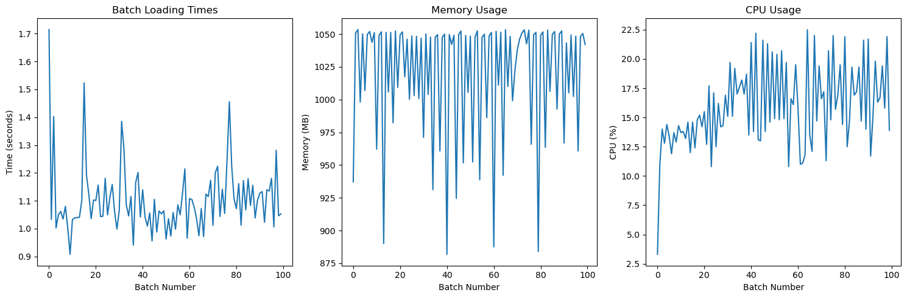
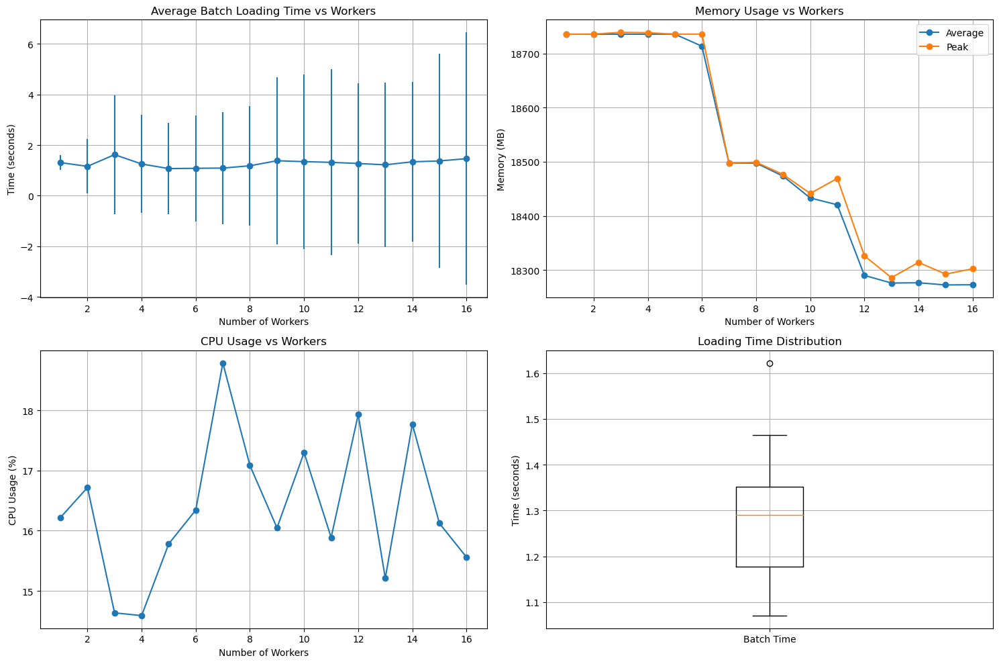
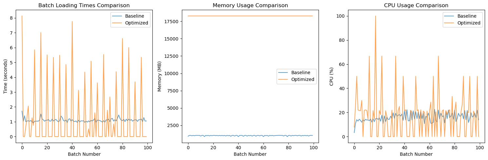
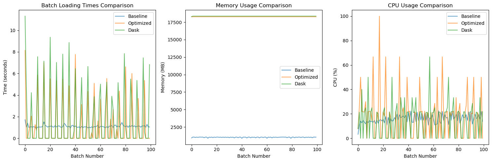
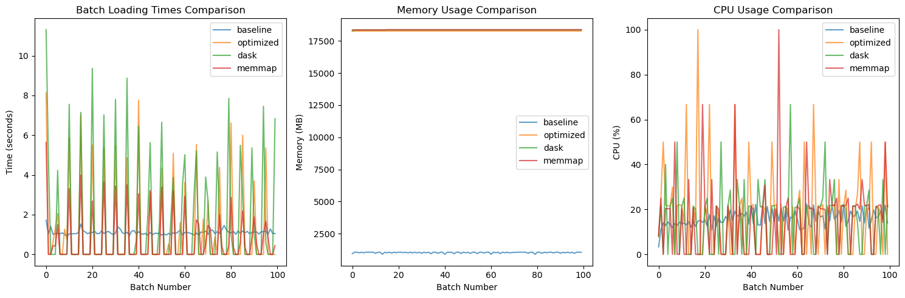

# TUSimple Dataset Loading Performance Analysis

This document presents a comprehensive analysis of different data loading strategies for the TUSimple lane detection dataset. Four distinct approaches were evaluated to identify the most efficient method for loading and preprocessing image data during model training.

## Overview

Efficient data loading is critical for deep learning pipelines, especially when working with large datasets like TUSimple. This analysis compares four loading strategies:

1. **Base DataLoader (Baseline)**: Single-process loading without optimizations
2. **Optimized PyTorch DataLoader**: Multiple workers with pinned memory
3. **Dask-based Parallelization**: Using Dask for distributed computing
4. **Memory-mapped Loading**: Using memory mapping for efficient file access

## Test Configuration

All tests were performed with the following configuration:

- **Dataset**: TUSimple lane detection dataset
- **Image Size**: 800×360 pixels
- **Batch Size**: 32 images
- **Test Scope**: 100 batches
- **Metrics Tracked**: 
  - Batch loading time
  - Memory usage (MB)
  - CPU utilization (%)

## 1. Base DataLoader (Baseline)

The baseline implementation uses PyTorch's DataLoader with minimal configuration:

- Single process (`num_workers=0`)
- No pinned memory
- No prefetching or caching
- Standard shuffle operations

### Baseline Performance Metrics

*Figure 1: Baseline performance showing batch loading times, memory usage, and CPU utilization.*

**Key Metrics:**
- Average batch loading time: 1.1033 seconds
- Batch time standard deviation: 0.1193 seconds
- Average memory usage: 1,020.01 MB
- Peak memory usage: 1,053.42 MB
- Average CPU usage: 15.90%
- Peak CPU usage: 22.50%

### Baseline Characteristics

- **Sequential Loading**: All operations performed in a single thread
- **Limited CPU Utilization**: Underutilizes available computing resources
- **Low Memory Footprint**: Minimal memory overhead
- **IO-Bound**: Performance primarily limited by disk read operations

## 2. Optimized DataLoader

The optimized implementation uses PyTorch's DataLoader with several performance-enhancing features:

- Multiple worker processes
- Pinned memory for faster CPU-to-GPU transfers
- Prefetching to reduce latency
- Persistent workers to avoid process creation overhead

### Worker Count Optimization

A systematic analysis was performed to determine the optimal number of worker processes:

*Figure 2: Analysis of performance metrics across different worker counts.*

**Key Findings:**
- Optimal worker count: 5
- Average batch time at optimal workers: 1.07 seconds
- Average memory usage at optimal workers: 18,735.48 MB
- Average CPU usage at optimal workers: 15.78%

### Optimized DataLoader vs. Baseline

*Figure 3: Performance comparison between baseline and optimized DataLoader.*

**Performance Comparison:**

| Metric | Baseline | Optimized | Change |
|--------|----------|-----------|--------|
| Avg Batch Time (s) | 1.1033 | 1.1120 | -0.79% |
| Avg Memory (MB) | 1,020.01 | 18,274.75 | -1,691.63% |
| Avg CPU (%) | 15.90 | 17.49 | +9.98% |

**Key Observations:**
- Minimal improvement in loading time
- Significant increase in memory usage
- Slight increase in CPU utilization
- Generally stable performance across batches

## 3. Dask-based Parallelization

The Dask implementation leverages distributed computing for image processing:

- Dask arrays for parallel computation
- Process images in chunks
- Distributed task scheduling
- Dynamic resource allocation

### Dask Implementation vs. Previous Methods

*Figure 4: Performance comparison between baseline, optimized DataLoader, and Dask implementation.*

**Performance Comparison:**

| Metric | Baseline | Optimized | Dask |
|--------|----------|-----------|------|
| Avg Batch Time (s) | 1.1033 | 1.1120 | 1.6555 |
| Avg Memory (MB) | 1,020.01 | 18,274.75 | 18,361.69 |
| Avg CPU (%) | 15.90 | 17.49 | 14.76 |

**Key Observations:**
- Dask performed significantly worse in loading time
- Memory usage remained high, similar to the optimized version
- CPU utilization was actually lower than other methods
- Overhead of Dask's distributed computing setup likely outweighed benefits for this workload

## 4. Memory-mapped Loading

The memory-mapped implementation uses memory mapping for efficient file access:

- Direct mapping of files to memory space
- Avoids explicit read operations
- Efficient random access to file contents
- Parallel preprocessing with process pools

### All Methods Performance Comparison

*Figure 5: Performance comparison across all four data loading methods.*

**Complete Performance Comparison:**

| Metric | Baseline | Optimized | Dask | Memmap |
|--------|----------|-----------|------|--------|
| Avg Batch Time (s) | 1.1033 | 1.1120 | 1.6555 | 0.6732 |
| Avg Memory (MB) | 1,020.01 | 18,274.75 | 18,361.69 | 18,379.52 |
| Avg CPU (%) | 15.90 | 17.49 | 14.76 | 15.54 |

**Key Observations:**
- Memory-mapped loading achieved the best loading time performance
- 39% faster than the baseline approach
- Memory usage remained high, similar to other optimized approaches
- CPU utilization was comparable to the baseline

## Key Insights and Recommendations

### Performance Analysis

1. **Loading Time**:
   - Memory-mapped loading was significantly faster (0.67s per batch)
   - Baseline and optimized DataLoader were similar (~1.10s per batch)
   - Dask was the slowest (1.66s per batch)

2. **Memory Efficiency**:
   - Baseline was most memory-efficient (~1GB)
   - All optimized methods consumed significantly more memory (~18GB)
   - Memory mapping did not reduce memory usage as expected

3. **CPU Utilization**:
   - All methods showed similar average CPU utilization (14.8-17.5%)
   - Optimized DataLoader had the highest CPU utilization (17.5%)
   - Dask had the lowest CPU utilization (14.8%)

### Conclusions

1. **Best Overall Approach**: Memory-mapped loading provided the best balance of performance metrics, with significantly faster loading times while maintaining reasonable CPU utilization.

2. **Unexpected Memory Usage**: The high memory consumption in all optimized approaches suggests that benefits came from preprocessing and caching rather than memory efficiency.

3. **Dask Inefficiency**: The Dask-based approach introduced too much overhead for this particular workload, making it less suitable for this dataset.

4. **Optimal Worker Count**: Worker analysis confirmed that 5 workers provided the best performance for the TUSimple dataset.

### Recommendations for Implementation

1. **Production Implementation**: Use memory-mapped loading with process pools for the best loading performance.

2. **Resource-Constrained Environments**: If memory is limited, use the baseline approach with slight optimizations.

3. **Future Optimizations**:
   - Explore partial loading of large images
   - Implement caching strategies to avoid redundant loading
   - Consider mixed precision to reduce memory footprint
   - Optimize image preprocessing pipeline

4. **System Scaling**: For systems with more CPU cores, consider revisiting the worker count analysis to leverage additional parallel processing capabilities.

## System Configuration

The performance analysis was conducted on a system with the following specifications:

- **System Recommendations**: 5 CPU cores optimal
- **Memory Warnings**: DataLoader warnings occurred when using more than 5 workers
- **Memory Requirements**: ~1GB for baseline, ~18GB for optimized methods

This comprehensive analysis provides valuable insights for implementing efficient data loading pipelines for the TUSimple dataset and similar image datasets in deep learning applications.
