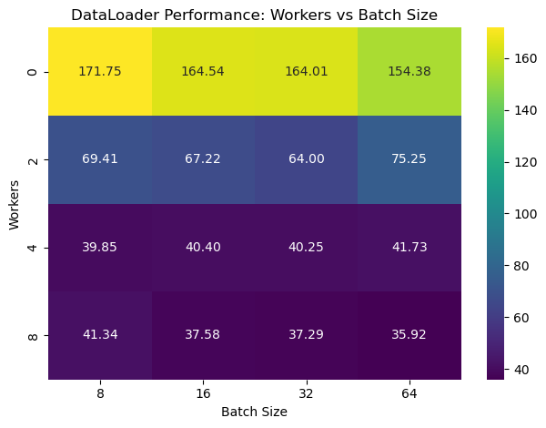

# DataLoader Optimization Analysis for TUSimple Dataset

## Overview

This document presents an analysis of PyTorch's DataLoader performance with various configurations when loading the TUSimple lane detection dataset. The goal was to identify the optimal combination of batch size and number of workers to minimize data loading time during training.

## System Configuration

The analysis was performed on the following system:

- **CPU:** Intel(R) Xeon(R) CPU E5-2680 v4 @ 2.40GHz
- **Cores:** 28 (14 cores per socket, 2 sockets)
- **Architecture:** x86_64
- **Cache:** 32K L1d, 32K L1i, 256K L2, 35840K L3
- **GPU:** None (CPU only)

## Methodology

The experiment involved testing different combinations of DataLoader parameters to identify the optimal configuration:

- **Batch Sizes Tested:** 8, 16, 32, 64
- **Worker Counts Tested:** 0, 2, 4, 8
- **Dataset:** TUSimple lane detection dataset
- **Image Size:** 800×360 pixels

For each configuration, the time required to load the entire dataset was measured, and the results were visualized using a heatmap to identify performance patterns.

### Testing Procedure

1. For each combination of batch size and worker count:
   - Create a DataLoader with the specified configuration
   - Measure the time taken to iterate through the entire dataset
   - Record the total time in seconds

2. Generate a heatmap visualization to compare the performance across all configurations

## Results

The following heatmap shows the data loading times (in seconds) for each configuration:

*Figure 1: Heatmap showing data loading times (in seconds) for different combinations of worker counts and batch sizes. Lower values (darker colors) indicate better performance.*

### Key Observations

1. **Effect of Worker Count:**
   - **8 workers** consistently achieved the fastest data loading times (~36-41 seconds)
   - **4 workers** showed slightly worse performance (~40-42 seconds)
   - **2 workers** exhibited significantly degraded performance (~64-75 seconds)
   - **0 workers** (single-process loading) was extremely slow (~154-172 seconds)

2. **Effect of Batch Size:**
   - For higher worker counts (8), larger batch sizes generally yielded better performance
   - With 8 workers, batch size 64 provided the best result (35.92 seconds)
   - The effect of batch size was less significant than the effect of worker count

3. **Performance Patterns:**
   - The performance difference between 4 and 8 workers was relatively small (~10%)
   - Using 0 workers was approximately 4-5 times slower than using 8 workers
   - The benefit of increasing workers began to plateau after 4 workers

## Analysis

### Worker Count Impact

The number of workers has the most dramatic impact on data loading performance:

1. **Parallelization Benefits:**
   - Each worker loads data in parallel, significantly reducing I/O bottlenecks
   - The nearly 5x speedup when moving from 0 to 8 workers demonstrates the importance of parallelization

2. **Diminishing Returns:**
   - The smaller improvement between 4 and 8 workers suggests approaching the point of diminishing returns
   - This may be influenced by:
     - I/O limitations
     - CPU core allocation efficiency
     - Memory bandwidth constraints

### Batch Size Impact

Batch size affects both memory usage and data loading frequency:

1. **Larger Batch Sizes:**
   - Reduce overhead from fewer iterations through the dataset
   - May enable more efficient memory access patterns
   - Best performance was achieved with the largest tested batch size (64)

2. **Considerations:**
   - While larger batches improve data loading efficiency, they require more memory
   - The optimal batch size for training may differ from the optimal size for data loading

## Recommendations

Based on this analysis, the following recommendations can be made for efficient data loading with the TUSimple dataset:

### Optimal Configuration

- **Worker Count:** 8 workers
- **Batch Size:** 64
- **Expected Performance:** ~36 seconds to load the entire dataset

### Alternative Configurations

1. **Memory-Constrained Systems:**
   - **Worker Count:** 4 workers
   - **Batch Size:** 32
   - **Expected Performance:** ~40 seconds (only ~11% slower than optimal)

2. **Low-Resource Systems:**
   - **Worker Count:** 4 workers
   - **Batch Size:** 16
   - **Expected Performance:** ~40 seconds

### Implementation Guidelines

1. **System-Specific Tuning:**
   - Number of workers should not exceed available CPU cores
   - For systems with fewer cores, adjust worker count accordingly

2. **Memory Considerations:**
   - Balance batch size with available system memory
   - Consider GPU memory constraints when selecting batch size for training

3. **Validation:**
   - Confirm optimal settings on the target system
   - Monitor system resources during training to ensure efficient utilization

## Conclusion

Optimal DataLoader configuration can significantly improve data loading performance for the TUSimple dataset. For the tested system, using 8 workers with a batch size of 64 provided the best results, reducing loading time by nearly 80% compared to single-process loading.

These findings highlight the importance of proper DataLoader configuration as part of the overall optimization strategy for deep learning workflows, particularly when working with large image datasets like TUSimple.
