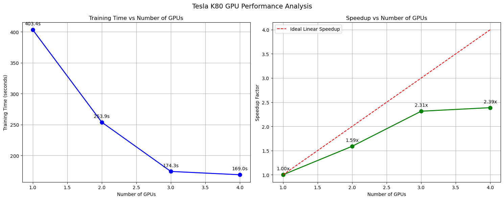

# Distributed Training and Mixed Precision Analysis

This document presents a comprehensive analysis of distributed data parallel (DDP) training on multiple GPUs and the impact of mixed precision training for the TUSimple lane detection model.

## System Configuration

### Hardware Specifications
- **CPU**: 28 physical cores
- **System Memory**: 503.64 GB
- **GPU Configuration**: 4x Tesla K80 GPUs, each with 11.17 GB memory and compute capability 3.7
- **Memory Usage Baseline**: 3.4%

### Software Environment
- **PyTorch Version**: 1.13.1
- **CUDA Version**: 11.6
- **Operating System**: Linux

## Distributed Data Parallel (DDP) Training Setup

### Dataset Configuration
- **Dataset Path**: TUSimple lane detection dataset
- **Image Size**: 800×360 pixels
- **Batch Size**: 8 (total across all GPUs)
- **Workers**: 4 per GPU

### Model Configuration
- **Architecture**: LaneDetectionModel with ResNet18 backbone
- **Classes**: 2 (lane/non-lane)
- **Pretrained**: Yes (using ImageNet weights)

### Training Parameters
- **Optimizer**: AdamW
- **Base Learning Rate**: 0.0005 (scaled with number of GPUs)
- **Weight Decay**: 0.0001
- **Gradient Accumulation Steps**: 2
- **Gradient Clipping**: 0.5

### DDP-Specific Settings
- **Backend**: NCCL (for GPU communication)
- **Initialization Method**: env://
- **Synchronized Batch Normalization**: Enabled
- **Find Unused Parameters**: Disabled
- **Memory Efficient Mode**: Enabled

## Multi-GPU Training Results

### Training Time by GPU Count

Each configuration was tested on Tesla K80 GPUs with identical training parameters (1 epoch):

| GPU Count | Training Time | Speedup | Parallel Efficiency |
|-----------|---------------|---------|---------------------|
| 1 GPU     | 403.41s       | 1.00x   | 100.0%              |
| 2 GPUs    | 253.93s       | 1.59x   | 79.4%               |
| 3 GPUs    | 174.35s       | 2.31x   | 77.1%               |
| 4 GPUs    | 168.99s       | 2.39x   | 59.7%               |

### Performance Visualization


*Figure 1: Training time and speedup factor analysis for multiple GPU configurations.*

### Individual GPU Results

#### 1 GPU Configuration

*Figure 2: Training results with 1 Tesla K80 GPU.*

#### 2 GPU Configuration

*Figure 3: Training results with 2 Tesla K80 GPUs.*

#### 3 GPU Configuration

*Figure 4: Training results with 3 Tesla K80 GPUs.*

#### 4 GPU Configuration

*Figure 5: Training results with 4 Tesla K80 GPUs.*

## Mixed Precision Training Analysis

Mixed precision training was tested on T4 GPUs (not K80s) due to their better support for FP16 operations.

### Performance Comparison

| Training Mode        | Time (seconds) | Improvement |
|----------------------|----------------|-------------|
| Mixed Precision      | 78.61          | 18.65%      |
| No Mixed Precision   | 96.63          | -           |


*Figure 6: Training time comparison between mixed precision and standard precision training.*

### Individual Results

#### With Mixed Precision

*Figure 7: Training results with mixed precision enabled.*

#### Without Mixed Precision

*Figure 8: Training results without mixed precision.*

## Implementation Details

The distributed training implementation includes several key components:

### 1. Process Management
- Uses `torch.multiprocessing.spawn` to create separate processes for each GPU
- Each process receives a unique rank and shares a common world size
- Processes synchronize at initialization and completion

### 2. DDP Model Configuration
```python
model = torch.nn.parallel.DistributedDataParallel(model, 
                                                 device_ids=[rank],
                                                 find_unused_parameters=True,
                                                 gradient_as_bucket_view=use_persistent_workers)
```

### 3. Data Distribution
```python
sampler = torch.utils.data.distributed.DistributedSampler(
    train_dataset,
    num_replicas=world_size,
    rank=rank,
    shuffle=True
)

loader_kwargs = {
    "batch_size": batch_size // world_size,
    "num_workers": num_workers,
    "pin_memory": not is_old_gpu,
    "sampler": sampler
}
```

### 4. Mixed Precision Setup (when enabled)
```python
# Not shown in code but referenced in configuration
scaler = torch.cuda.amp.GradScaler(enabled=use_mixed_precision)

with torch.cuda.amp.autocast(enabled=use_mixed_precision):
    outputs = model(inputs)
    loss = criterion(outputs, targets)

scaler.scale(loss).backward()
scaler.step(optimizer)
scaler.update()
```

## Analysis and Conclusions

### Multi-GPU Scaling Efficiency

1. **Sub-linear Scaling**: 
   - While adding GPUs improves performance, the scaling is sub-linear
   - 4 GPUs only achieve 2.39x speedup instead of theoretical 4x
   - Parallel efficiency drops from 79.4% with 2 GPUs to 59.7% with 4 GPUs

2. **Diminishing Returns**:
   - Minimal improvement from 3 GPUs (174.35s) to 4 GPUs (168.99s)
   - Adding the 4th GPU only provides 3.1% additional speedup

3. **Likely Bottlenecks**:
   - Communication overhead between GPUs
   - Synchronization barriers in the DDP implementation
   - I/O limitations during data loading
   - Gradient synchronization costs

### Mixed Precision Benefits

1. **Performance Improvement**:
   - 18.65% faster training time with mixed precision
   - Reduced from 96.63s to 78.61s per epoch

2. **Resource Efficiency**:
   - Lower memory footprint (though not quantified in the results)
   - Better utilization of Tensor Cores on compatible GPUs (T4)

## Recommendations

1. **GPU Count Optimization**:
   - For this specific model and dataset, 3 GPUs provide the best balance of speedup and efficiency
   - Using 4 GPUs only makes sense if time is more critical than resource efficiency

2. **Mixed Precision Adoption**:
   - Implement mixed precision training on compatible GPUs
   - Provides substantial performance gains with minimal implementation complexity
   - Should be considered standard for modern training pipelines

3. **Further Optimizations**:
   - Tune batch size and gradient accumulation steps based on available GPU memory
   - Optimize data loading pipeline to reduce I/O bottlenecks
   - Consider model-specific optimizations like layer fusion or architecture changes

This analysis demonstrates the effectiveness of both distributed training and mixed precision techniques for accelerating deep learning workflows, with quantifiable benefits in training time and resource utilization.
