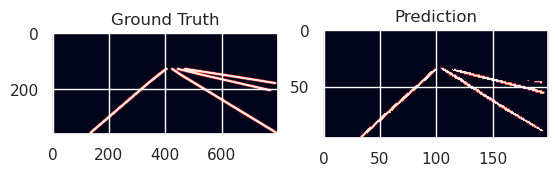

# Lane Detection Model Architecture and Evaluation

This document provides a detailed explanation of the Lane Detection model developed for the TUSimple dataset, including its architecture, training process, and evaluation results.

## Dataset Overview

The model uses the TUSimple lane detection dataset, which contains road images with labeled lane markings. The dataset is processed using a custom `LaneDataset` class that:

- Loads images and segmentation labels from the TUSimple dataset
- Preprocesses images to a specified size (typically 800×360 or 880×368 pixels)
- Converts data to tensors suitable for model training
- Provides segmentation labels for lane detection


*Figure 1: Sample images from the TUSimple dataset showing original images (left), segmentation labels (middle), and instance segmentation labels (right).*

## Model Architecture

The Lane Detection model uses a specialized architecture combining a ResNet-50 backbone with Coordinate Attention mechanisms and a U-Net-like decoder for semantic segmentation.

### Key Components

#### 1. Encoder
- **Backbone**: Pre-trained ResNet-50 (excluding fully connected layers)
- **Purpose**: Extract hierarchical features from input images
- **Structure**: Multiple bottleneck blocks with convolutional layers, batch normalization, and ReLU activations

#### 2. Coordinate Attention Mechanism
The model incorporates a novel Coordinate Attention mechanism that enhances spatial and channel focus:

- **Horizontal and Vertical Pooling**: Captures spatial relationships across dimensions
- **Dimensionality Reduction**: Uses convolutional layers to process pooled features efficiently
- **Attention Maps**: Applies sigmoid activation to generate attention weights
- **Feature Enhancement**: Multiplies original features with attention weights

```
CoordAttention(
  (pool_h): AdaptiveAvgPool2d(output_size=(None, 1))
  (pool_w): AdaptiveAvgPool2d(output_size=(1, None))
  (conv1): Conv2d(2048, 64, kernel_size=(1, 1), stride=(1, 1))
  (relu): ReLU(inplace=True)
  (conv_h): Conv2d(64, 2048, kernel_size=(1, 1), stride=(1, 1))
  (conv_w): Conv2d(64, 2048, kernel_size=(1, 1), stride=(1, 1))
)
```

#### 3. Decoder (U-Net-like)
- **Upsampling Path**: Sequential upsampling blocks to restore spatial resolution
- **Blocks**:
  - `up1`: 2048 → 512 channels
  - `up2`: 512 → 128 channels
  - `up3`: 128 → 32 channels
- **Final Layer**: 1×1 convolution to produce class probabilities (2 classes: lane/non-lane)

### Complete Model Flow

1. **Input**: RGB road images (resized to 800×360)
2. **Encoding**: Features extracted through ResNet-50 backbone
3. **Attention**: Coordinate Attention applied to focus on relevant spatial regions
4. **Decoding**: Upsampling through transposed convolutions to restore resolution
5. **Output**: Binary segmentation mask indicating lane presence

## Loss Functions

The model training employs multiple specialized loss functions:

### 1. Dice Loss
- Measures overlap between predicted and ground truth segmentation masks
- Scale: 0 (perfect overlap) to 1 (no overlap)
- Advantages: Less sensitive to class imbalance than pixel-wise cross-entropy

### 2. IoU Loss
- Computes Intersection over Union between predictions and ground truth
- Particularly effective for segmentation tasks with overlapping regions
- Directly optimizes the evaluation metric commonly used in segmentation tasks

### 3. Cross Entropy Loss
- Standard classification loss for segmentation outputs
- Used during training for binary classification of pixels (lane/non-lane)

## Training Process

The model was trained using the following configuration:

### Training Setup
- **Optimizer**: AdamW with learning rate 0.001 and weight decay 1e-4
- **Batch Size**: 8
- **Image Size**: 800×360 pixels
- **Device**: CPU (as indicated in the training logs)

### Training Loop
- **Epochs**: 5 complete epochs through the dataset
- **Checkpointing**: Model weights saved after each epoch and when validation loss improved
- **Metrics**: Loss and accuracy recorded for both training and validation sets

### System Performance
During training, the following system metrics were observed:
- **CPU Usage**: 98.7-99.9%
- **Memory Usage**: 5.5%
- **Time per Epoch**: Approximately 1800-1890 seconds (30-31.5 minutes)

### Training Results
The model showed consistent improvement over the training epochs:

| Epoch | Train Loss | Train Accuracy | Validation Loss | Validation Accuracy |
|-------|------------|----------------|-----------------|---------------------|
| 1     | 0.0726     | 97.08%         | 0.0527          | 97.79%              |
| 2     | 0.0517     | 97.78%         | 0.0530          | 97.70%              |
| 3     | 0.0477     | 97.95%         | 0.0468          | 98.06%              |
| 4     | 0.0457     | 98.03%         | 0.0493          | 98.03%              |
| 5     | 0.0437     | 98.11%         | 0.0443          | 98.15%              |

The results demonstrate the model's ability to achieve high accuracy (>98%) on both training and validation data, indicating good generalization without significant overfitting.

## Model Evaluation

The trained model was evaluated on sample images from the validation set and on custom road images.

### Evaluation on Validation Data

*Figure 2: Comparison of ground truth segmentation (left) and model prediction (right) on a validation sample.*

### Evaluation on Custom Image

*Figure 3: Model prediction on a custom road image showing original image (left) and segmentation prediction (right).*

## Conclusion

The Lane Detection model demonstrates excellent performance in segmenting lane markings from road images. Key strengths include:

1. **High Accuracy**: Consistently achieved over 98% accuracy on validation data
2. **Effective Architecture**: The combination of ResNet backbone with Coordinate Attention and U-Net decoder proved effective for the task
3. **Robust Performance**: The model generalizes well to both validation samples and custom images

The model shows potential for real-world applications in autonomous driving systems, where accurate lane detection is crucial for navigation and safety.
