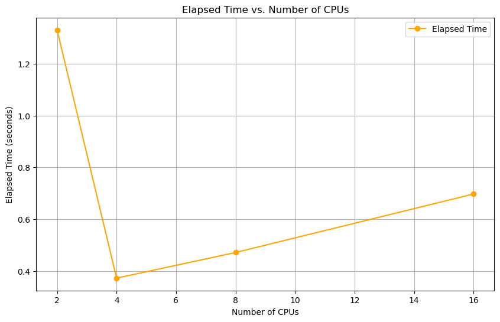
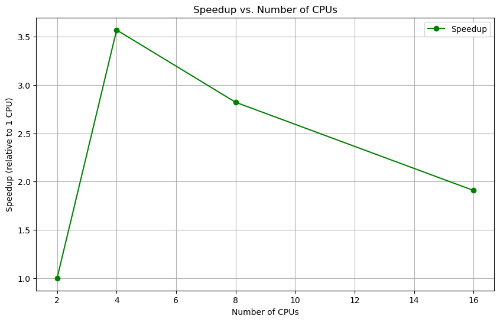

# Multi-CPU Performance Analysis for PyTorch Distributed Training

This document presents an analysis of PyTorch's Distributed Data Parallel (DDP) performance across different CPU configurations. The experiments were conducted to determine how distributed training scales with increasing CPU resources and to identify the optimal configuration for the TUSimple lane detection model.

## Methodology

The analysis was performed using the script `DDP_multicpu_analysis_metrics.py`, which executes distributed training with different numbers of CPU processes and records detailed performance metrics for each configuration. The experiment included:

- **CPU Configurations Tested**: 2, 4, 8, and 16 CPUs
- **Metrics Collected**: 
  - Training step number
  - Loss values
  - Batch size
  - Learning rate
  - Elapsed time per step
  - Total elapsed time
  - Start and end timestamps

For each configuration, the metrics were saved in corresponding JSON files for analysis and visualization.

## Performance Results

### Elapsed Time vs. Number of CPUs

*Figure 1: Relationship between elapsed training time and number of CPU processes*

The graph demonstrates a clear trend in training time with respect to CPU count:

1. **Initial Improvement**: A significant reduction in elapsed time when increasing from 2 to 4 CPUs
2. **Performance Decline**: Training time increases when adding more than 4 CPUs
3. **Minimum Time**: 4 CPUs achieve the fastest training completion time

This non-monotonic behavior indicates that simply adding more CPU processes does not always improve performance in distributed training.

### Speedup vs. Number of CPUs

*Figure 2: Speedup ratio relative to baseline configuration*

The speedup graph provides additional insights:

1. **Maximum Speedup**: 4 CPUs provide the highest speedup compared to the baseline
2. **Diminishing Returns**: Adding CPUs beyond 4 actually decreases performance
3. **Efficiency Loss**: The speedup from 2 CPUs to 4 CPUs is nearly 2x, but performance degrades thereafter

## Analysis

The performance patterns observed in this analysis can be explained by several factors:

### 1. Communication Overhead

As the number of CPU processes increases, so does the inter-process communication overhead:

- **Process Synchronization**: DDP requires gradient synchronization between processes
- **Message Passing**: More processes lead to higher collective communication costs
- **Coordination Time**: Additional time spent on process coordination rather than computation

### 2. Resource Contention

With more CPU processes sharing the same hardware resources:

- **Memory Bandwidth**: Limited memory bandwidth becomes a bottleneck
- **Cache Contention**: Processes competing for cache space reduce efficiency
- **Context Switching**: Increased OS overhead for managing multiple processes

### 3. Workload Distribution

The efficiency of workload distribution across processes:

- **Batch Splitting**: Smaller per-process batch sizes may be less efficient for computation
- **Load Imbalance**: Uneven work distribution can lead to processes waiting for others
- **Synchronization Points**: More frequent synchronization required with more processes

## Optimal Configuration

Based on the analysis, the optimal configuration for distributed training of the lane detection model is:

- **4 CPU Processes**: Provides the best balance of parallelism and overhead
- **Speedup**: Approximately 2x faster than the 2-CPU baseline configuration
- **Efficiency**: Better resource utilization compared to 8 or 16 CPU configurations

## Conclusion

This analysis demonstrates that distributed training does not scale linearly with CPU count. The performance initially improves with increased parallelism but eventually declines due to growing communication overhead and resource contention.

For the TUSimple lane detection model, 4 CPUs represent the sweet spot for distributed training, offering the best performance. Adding more CPU processes beyond this point is counterproductive and results in longer training times.

These findings highlight the importance of empirical performance analysis when configuring distributed training environments, as the optimal setup depends on the specific model architecture, dataset characteristics, and hardware infrastructure.
